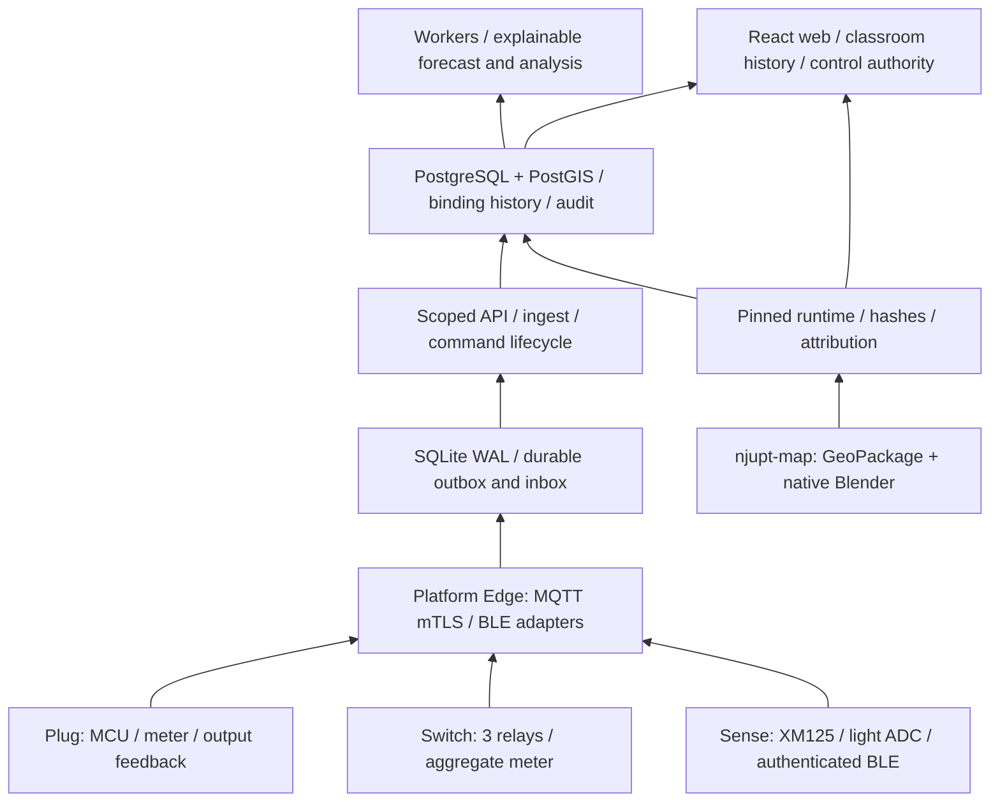

# 五仓本机维护与验证

维护对象是五个仓库。各自只保存当前可编辑源、必要的锁定消费包和小型验证
记录；被替换的脚本、旧设计与生成产物由本地 Git 归档历史保留。

| 仓库 | 当前职责 | 本机入口 |
| --- | --- | --- |
| [carbentra-smart-plug](https://github.com/hicancan/carbentra-smart-plug) | ESP32-C3 插座、计量/输出反馈、安全状态机、原生 ECAD/机械 | scripts/check_windows.ps1、scripts/rebuild_windows.ps1 |
| [carbentra-smart-switch](https://github.com/hicancan/carbentra-smart-switch) | 三路开关、合计计量、原生 ECAD/机械 | LOCAL_BUILD.md、scripts/dev.ps1 |
| [carbentra-presence-sensor](https://github.com/hicancan/carbentra-presence-sensor) | Sense B 有线 5 V 雷达/原始光照、认证 BLE | LOCAL_BUILD.md、scripts/dev.ps1 |
| [carbentra-campus-platform](https://github.com/hicancan/carbentra-campus-platform) | API、网页、后台任务、Edge、唯一 IoT 合同及空间消费包 | tools/verify-local.ps1、tools/verify-deployment.ps1 |
| [njupt-map](https://github.com/hicancan/njupt-map/tree/local-toolchain-20261001) | 唯一校园 GIS/Blender 作者源及运行时发布 | src/check.ps1 -Full -Render |

空间拓扑与电气拓扑分别维护；精确编号及历史绑定连接设备、房间和地图。
Sense 不提供 PIR、电池寿命或标定照度；Switch ACK 不代表独立灯具反馈；
本地控制验收通过模拟端点完成，真实吸合仍保持禁止。平台预测是可解释的
统计模型，不需要给它安装大模型或 GPU 框架。

## 本机工具分工

普通 Python 使用 uv 0.11.17 / Python 3.12.13 的项目 .venv；前端使用
Node 24.16.0。C 主机检查使用 MSVC 2022，目标使用 ESP-IDF 5.4.3 或
Zephyr 4.1.0 / SDK 0.17.0。KiCad 10.0.5、Blender 5.2.2 LTS、FreeCAD 1.1.4
各自在原生进程内使用自带 Python，避免不兼容的原生 DLL 混入 uv 环境。
缺失的官方工具已安装到 D:/Dev 下的独立目录，复用已有工具与缓存。

三硬件项目的全量检查均完成真实 MCU 编译、主机逻辑、原生 ECAD 和机械
导出/重开；四块板 ERC/DRC 全部通过，检查未靠放宽规则通过。机械展示使用
RTX 5060 OptiX，GPU 任务串行。地图完成 63 项测试、133 个原生文件检查、
129 个室内/外观检查和实际渲染；QGIS 打开 12 个图层全部有效。

平台完成全新数据库冷启动、最终 413 项 PostgreSQL/后端测试、200 项前端测试、
真实 broker mTLS/断网重启、生产 HTTPS、备份恢复及实际浏览器控制链。
独占规模基准和真实物理设备验收有独立条件，不冒充已执行。各仓的当前验证
记录给出精确步骤、源/产物散列与物理边界。

公开空间包保留 603 个空间与 564 个来源区域身份；未审查的参考平面图
描摹坐标不分发，网页使用完整列表/历史矩阵。129 个固定版本外观资产属于
必要消费包；全校轻量回退与逐栋加载保留，不能把全部高精模型同时加载。

## 历史和公开发布

新 CARBENTRA 公共仓库以清理后的树开始 main。旧完整交付与本机升级历史
保留在本地 archive/pre-open-source-20261001 分支，不将其中的厂商 PDF、
参考描摹或旧大产物自动重新分发。已有插座 main 的云端历史保留，其当前
清理树作为正常新提交发布。地图在 local-toolchain-20261001 上继续本次工作，
原 main 不改动。新公共 main 的源码树与本机实际验证树一致。

原创代码采用 AGPL-3.0-or-later，原创硬件设计采用 CERN-OHL-S-2.0，原创
文档/展示采用 CC-BY-4.0；第三方、OSM 和模型资源按各自授权处理。根
LICENSES.md 定义范围，历史文件不因为归档而自动取得新授权。

原交付的 30 页答辩稿、PDF、讲稿和未锁依赖生成源是独有历史成果，作为
平台 historical-defense-20261001 Release 附件与散列清单保留。它描述原先
证据快照，不代表此次 Windows 验证；未将旧生成器加入当前工具链，也不
新增第六个仓库。未来更新答辩时应重新锁定依赖并刷新本机证据。

短期下载、构建、证书和日志使用 D:/Temp/codex 下的任务目录，保存必要
验证记录/上传包后清理。正式工具、项目 .venv 与工具管理的复用缓存保留。
